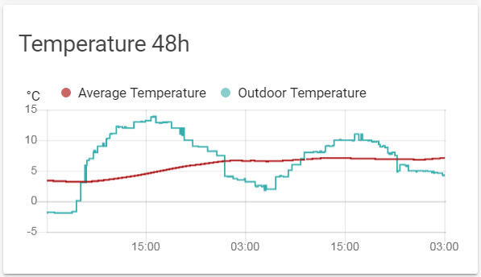

*Please :star: this repo if you find it useful*

# Average Sensor for Home Assistant

[](https://github.com/Limych/ha-average/releases)
[](https://github.com/Limych/ha-average/commits/master)
[](LICENSE.md)


[][hacs]


[](https://github.com/Limych/ha-average/pulls)
[](https://github.com/Limych/ha-average/issues?q=is%3Aopen+is%3Aissue+label%3ABug)

[][forum-support]

This sensor allows you to calculate the average state for one or more sensors over a specified period. Or just the average current state for one or more sensors, if you do not need historical data.

Initially it was written special for calculating of average temperature, but now it can calculate average of any numerical data.



What makes this sensor different from others built into HA:

**Compare with the min-max sensor:**\
This sensor in the mean mode produces exactly the same average value from several sensors. But, unlike our sensor, it cannot receive the current temperature data from a weather, climate and water heater entities.

**Compare with statistics sensor:**\
This sensor copes with the averaging of data over a certain period of time. However… 1) it cannot work with several sources at once (and can't receive temperature from weather, climate and water heater entities, like min-max sensor), 2) when calculating the average, it does not take into account how much time the temperature value was kept, 3) it has a limit on the number of values ​​it averages - if by chance there are more values, they will be dropped.

*NB. You can find a real example of using this component in [my Home Assistant configuration](https://github.com/Limych/HomeAssistantConfiguration).*

I also suggest you [visit the support topic][forum-support] on the community forum.

## Breaking changes

* Since version 1.3.0 the default sensor name is “Average” instead of “Average Temperature”

## Installation

1. Using the tool of choice open the directory (folder) for your HA configuration (where you find `configuration.yaml`).
1. If you do not have a `custom_components` directory (folder) there, you need to create it.
1. In the `custom_components` directory (folder) create a new folder called `average`.
1. Download _all_ the files from the `custom_components/average/` directory (folder) in this repository.
1. Place the files you downloaded in the new directory (folder) you created.
1. Restart Home Assistant
1. Add `average` sensor to your `configuration.yaml` file:

    To measure the average current temperature from multiple sources:
    ```yaml
    # Example configuration.yaml entry
    sensor:
      - platform: average
        name: 'Average Temperature'
        entities:
          - weather.gismeteo
          - sensor.owm_temperature
          - sensor.dark_sky_temperature
    ```

    To measure average temperature for some period:
    ```yaml
    # Example configuration.yaml entry
    sensor:
      - platform: average
        name: 'Average Temperature'
        duration:
          days: 1
        entities:
          - sensor.gismeteo_temperature
    ```
    
    or you can combine this variants for some reason.

<p align="center">* * *</p>
I put a lot of work into making this repo and component available and updated to inspire and help others! I will be glad to receive thanks from you — it will give me new strength and add enthusiasm:
<p align="center"><br>
<a href="https://www.patreon.com/join/limych?" target="_blank"></a>
<a href="https://www.paypal.com/cgi-bin/webscr?cmd=_donations&business=UAGFL5L6M8RN2&item_name=[average]+Donation+for+a+big+barrel+of+coffee+:)&currency_code=EUR&source=url" target="_blank"></a>
</p>

### Configuration Variables
  
**entities**:\
  _(list) (Required)_\
  A list of temperature sensor entity IDs.
  
  *NB* You can use weather provider, climate and water heater entities as a data source. For that entities sensor use values of current temperature.

**name**:\
  _(string) (Optional)_\
  Name to use in the frontend.\
  _Default value: "Average"_
  
**duration**:\
  _(time) (Optional)_\
  Duration of the measure from the current time.
  
  Different syntaxes for the duration are supported, as shown below.

  ```yaml  
  # 15 seconds
  duration: 15
  ```

  ```yaml  
  # 6 hours
  duration: 06:00
  ```

  ```yaml  
  # 1 minute, 30 seconds
  duration: 00:01:30
  ```

  ```yaml  
  # 2 hours and 30 minutes
  duration:
    # supports seconds, minutes, hours, days
    hours: 2
    minutes: 30
  ```

**precision**:\
  _(number) (Optional)_\
  The number of decimals to use when rounding the sensor state.\
  _Default value: 1_

## Track updates

You can automatically track new versions of this component and update it by [custom-updater](https://github.com/custom-components/custom_updater) (deprecated) or [HACS][hacs].

For custom-updater to initiate tracking add this lines to you `configuration.yaml` file:

```yaml
# Example configuration.yaml entry
custom_updater:
  track:
    - components
  component_urls:
    - https://raw.githubusercontent.com/Limych/ha-average/master/tracker.json
```

[forum-support]: https://community.home-assistant.io/t/average-sensor/111674
[hacs]: https://github.com/custom-components/hacs
